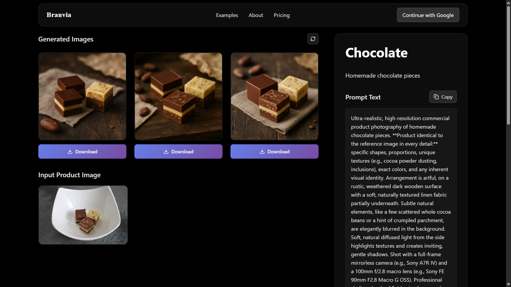
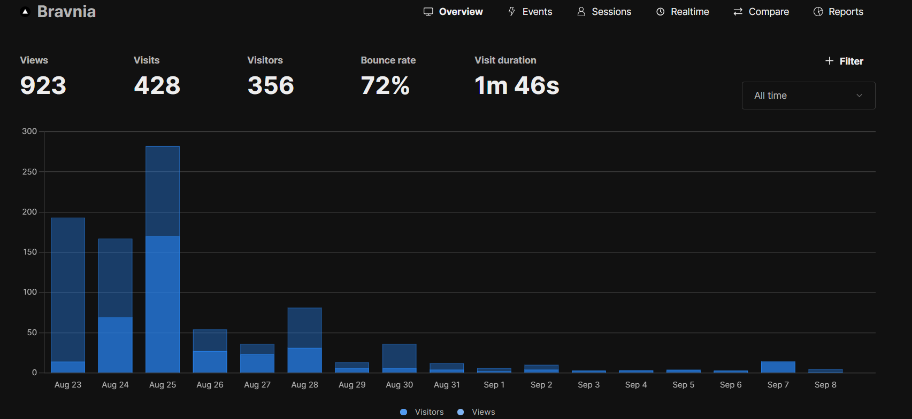

## Branvia

Website: https://branvia.art

A monorepo for AI product image generation with a Next.js web app, a BullMQ worker, and a shared Prisma database package.

### Project idea: 

An AI-powered platform for small businesses, solopreneurs, and creators to generate professional, on-brand product images quickly-removing the need for complex photo shoots or design tools. Branvia focuses on speed, consistency, and ease-of-use compared to Canva or similar tools.

### Project structure
```text
/ (repo root)
├─ packages/
│  └─ database/               # Prisma schema, client, migrations, seed
│     ├─ prisma/
│     │  ├─ schema.prisma
│     │  └─ migrations/
│     └─ index.ts
├─ web/                        # Next.js 15 app (React 19)
│  ├─ src/
│  │  ├─ _actions/            # Server actions (wrapped via createServerAction)
│  │  ├─ _components/         # Shared UI/components
│  │  ├─ _lib/                # Auth, DB, queues, S3, schemas, services, utils
│  │  └─ app/                 # App Router pages and API routes
│  └─ public/                 # Static assets
├─ worker/                     # BullMQ processors and queue workers
│  └─ src/
│     ├─ processors/          # imageGeneration, email, cleanup, discord
│     └─ queues/
├─ docker/                     # Dockerfiles for web and worker
├─ scripts/                    # Helper scripts (deploy, env copy, cleanup)
├─ docker-compose.yml          # Production compose
├─ compose.dev.yaml            # Development compose
└─ pnpm-workspace.yaml         # Monorepo workspace config
```

### Tech stack
- **Frontend**: Next.js 15, React 19, TypeScript, Framer Motion
- **Server actions**: Zod-validated via `createServerAction` with Redis rate limiting
- **Background jobs**: BullMQ with Redis, Bull Board for monitoring
- **Database**: PostgreSQL via Prisma (`@branvia/database` package)
- **Storage**: AWS S3 (`@aws-sdk/client-s3`)
- **Auth**: `better-auth` (no next-auth)
- **Cache/Queues**: Redis (`ioredis`)
- **AI APIs**: Google Gemini (`@google/generative-ai`), OpenAI (`openai`) used primarily in worker processors
- **Monorepo**: pnpm workspaces
- **CI/Build helpers**: Type checks and scripts under `scripts/`

### Deployment
- **Infrastructure**: Hetzner VPS
- **Orchestration/Management**: Dokploy (manages app services, env, deploys)
- **Containers**: Web and Worker built from `docker/Dockerfile.web` and `docker/Dockerfile.worker`, composed via `docker-compose.yml` (prod) or `compose.dev.yaml` (dev).

For development and scripts, a single `.env` is used at the repo root and commands are run from the root. Use pnpm globally; web/worker/database packages are wired via `workspace:*`.

### Startup analysis
- **Current traction**: Estimated reach ~2,000; ~400 site visits; low conversions.
- **Initial hypothesis**: Unlike Moodpaper (wallpapers by mood), Branvia solves a real business problem and should convert better.
- **Finding**: Targeting the right audience is harder than expected. Many SMBs/solopreneurs default to tools like Canva or Nano Banana and can self-serve.
- **Competitive reality**: Strong horizontal tools lower switching costs; Branvia must deliver clearly superior outcomes or speed.
- **Value hypothesis**: Problem is real, but perceived value/urgency isn’t high enough for the current audience and positioning.

- **Potential next steps (concise)**:
  - Narrow ICP to segments with recurring need and willingness to pay (e.g., Amazon/Etsy sellers, DTC with weekly launches, agencies).
  - Focus on one killer workflow that beats Canva/Nano on outcome quality or time-to-result (e.g., batch on-brand product scenes with zero prompt hassle).
  - Embed where users already are (Shopify/WooCommerce/Notion/Drive) to reduce friction; consider a Chrome app or simple CLI for batch.
  - Strengthen proof: before/after case studies, ROI metrics, social proof on landing, and an opinionated starter pack.
  - Rethink onboarding: demo-first, templates-by-vertical, try-without-upload, no-account first render.

### Screenshots

- Product example (Choco):



- Analytics (Umami):



---

This monorepo will be reused for future startups and experiments. The website will remain online at `branvia.art` for a while but is planned to be shut down soon.
    
